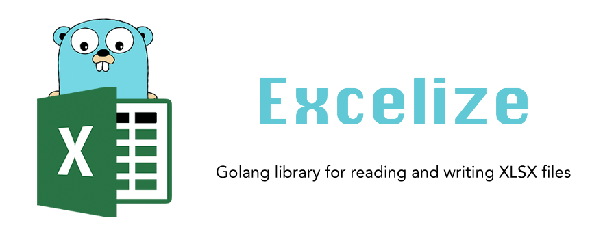

# Excelize

[](https://travis-ci.org/Luxurioust/excelize)
[](https://codecov.io/gh/Luxurioust/excelize)
[](https://goreportcard.com/report/github.com/Luxurioust/excelize)
[](https://godoc.org/github.com/Luxurioust/excelize)
[](https://opensource.org/licenses/BSD-3-Clause)
[](https://gitter.im/xuri-excelize/Lobby)

## Introduction

Excelize is a library written in pure Golang and providing a set of functions that allow you to write to and read from XLSX files. Support reads and writes XLSX file generated by Office Excel 2007 and later. Support save file without losing original charts of XLSX. The full API docs can be seen using go's built-in documentation tool, or online at [godoc.org](https://godoc.org/github.com/Luxurioust/excelize).

## Basic Usage

### Installation

```go
go get github.com/Luxurioust/excelize
```

### Create XLSX file

Here is a minimal example usage that will create XLSX file.

```go
package main

import (
    "fmt"
    "os"

    "github.com/Luxurioust/excelize"
)

func main() {
    xlsx := excelize.CreateFile()
    // Create a new sheet.
    xlsx.NewSheet(2, "Sheet2")
    // Set value of a cell.
    xlsx.SetCellValue("Sheet2", "A2", "Hello world.")
    xlsx.SetCellValue("Sheet1", "B2", 100)
    // Set active sheet of the workbook.
    xlsx.SetActiveSheet(2)
    // Save xlsx file by the given path.
    err := xlsx.WriteTo("/tmp/Workbook.xlsx")
    if err != nil {
        fmt.Println(err)
        os.Exit(1)
    }
}
```

### Reading XLSX file

The following constitutes the bare to read a XLSX document.

```go
package main

import (
    "fmt"
    "os"

    "github.com/Luxurioust/excelize"
)

func main() {
    xlsx, err := excelize.OpenFile("/tmp/Workbook.xlsx")
    if err != nil {
        fmt.Println(err)
        os.Exit(1)
    }
    // Get value from cell by given sheet index and axis.
    cell := xlsx.GetCellValue("Sheet1", "B2")
    fmt.Println(cell)
    // Get all the rows in a sheet.
    rows := xlsx.GetRows("Sheet2")
    for _, row := range rows {
        for _, colCell := range row {
            fmt.Print(colCell, "\t")
        }
        fmt.Println()
    }
}
```

### Add picture to XLSX file

```go
package main

import (
    "fmt"
    "os"
    _ "image/gif"
    _ "image/jpeg"
    _ "image/png"

    "github.com/Luxurioust/excelize"
)

func main() {
    xlsx, err := excelize.OpenFile("/tmp/Workbook.xlsx")
    if err != nil {
        fmt.Println(err)
        os.Exit(1)
    }
    // Insert a picture.
    err = xlsx.AddPicture("Sheet1", "A2", "/tmp/image1.gif", 0, 0, 1, 1)
    if err != nil {
        fmt.Println(err)
    }
    // Insert a picture to sheet with scaling.
    err = xlsx.AddPicture("Sheet1", "D2", "/tmp/image2.jpg", 0, 0, 0.5, 0.5)
    if err != nil {
        fmt.Println(err)
    }
    // Insert a picture offset in the cell.
    err = xlsx.AddPicture("Sheet1", "H2", "/tmp/image3.png", 15, 10, 1, 1)
    if err != nil {
        fmt.Println(err)
    }
    // Save the xlsx file with the origin path.
    err = xlsx.Save()
    if err != nil {
        fmt.Println(err)
        os.Exit(1)
    }
}
```

## Contributing

Contributions are welcome! Open a pull request to fix a bug, or open an issue to discuss a new feature or change.

## Credits

Some struct of XML originally by [tealeg/xlsx](https://github.com/tealeg/xlsx).

## Licenses

This program is under the terms of the BSD 3-Clause License. See [https://opensource.org/licenses/BSD-3-Clause](https://opensource.org/licenses/BSD-3-Clause).
