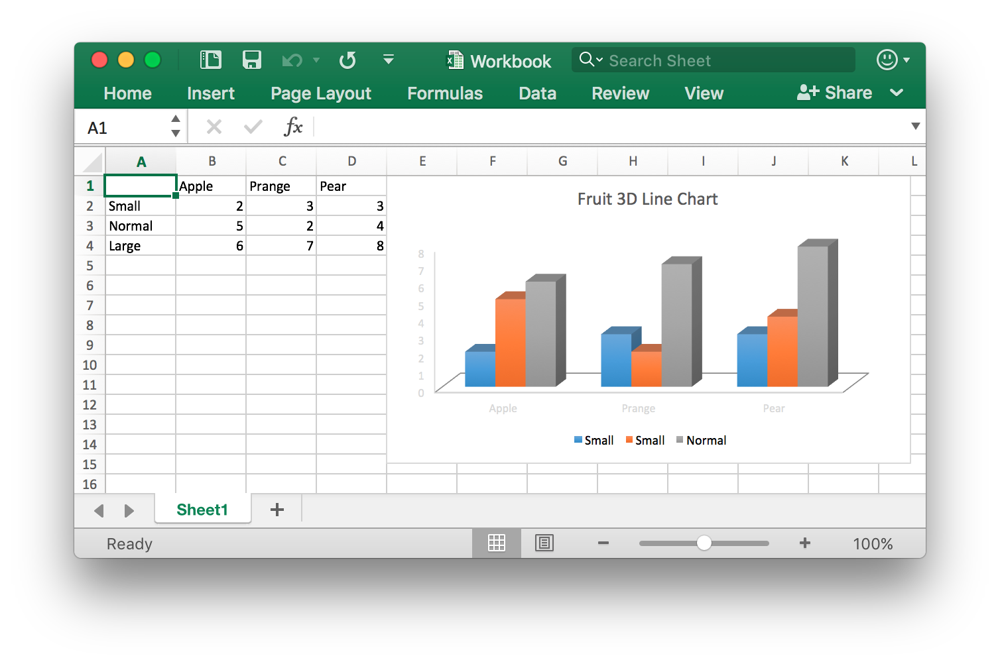

<p align="center"></p>

<p align="center">
    <a href="https://github.com/xuri/excelize/actions/workflows/go.yml"></a>
    <a href="https://codecov.io/gh/qax-os/excelize"></a>
    <a href="https://goreportcard.com/report/github.com/xuri/excelize"></a>
    <a href="https://pkg.go.dev/github.com/xuri/excelize/v2"></a>
    <a href="https://opensource.org/licenses/BSD-3-Clause"></a>
    <a href="https://www.paypal.com/paypalme/xuri"></a>
</p>

# Excelize

## Introduction

Excelize is a library written in pure Go providing a set of functions that allow you to write to and read from XLSX / XLSM / XLTM / XLTX files. Supports reading and writing spreadsheet documents generated by Microsoft Excel&trade; 2007 and later. Supports complex components by high compatibility, and provided streaming API for generating or reading data from a worksheet with huge amounts of data. This library needs Go version 1.15 or later. The full API docs can be seen using go's built-in documentation tool, or online at [go.dev](https://pkg.go.dev/github.com/xuri/excelize/v2) and [docs reference](https://xuri.me/excelize/).

## Basic Usage

### Installation

```bash
go get github.com/xuri/excelize
```

- If your packages are managed using [Go Modules](https://blog.golang.org/using-go-modules), please install with following command.

```bash
go get github.com/xuri/excelize/v2
```

### Create spreadsheet

Here is a minimal example usage that will create spreadsheet file.

```go
package main

import (
    "fmt"

    "github.com/xuri/excelize/v2"
)

func main() {
    f := excelize.NewFile()
    // Create a new sheet.
    index := f.NewSheet("Sheet2")
    // Set value of a cell.
    f.SetCellValue("Sheet2", "A2", "Hello world.")
    f.SetCellValue("Sheet1", "B2", 100)
    // Set active sheet of the workbook.
    f.SetActiveSheet(index)
    // Save spreadsheet by the given path.
    if err := f.SaveAs("Book1.xlsx"); err != nil {
        fmt.Println(err)
    }
}
```

### Reading spreadsheet

The following constitutes the bare to read a spreadsheet document.

```go
package main

import (
    "fmt"

    "github.com/xuri/excelize/v2"
)

func main() {
    f, err := excelize.OpenFile("Book1.xlsx")
    if err != nil {
        fmt.Println(err)
        return
    }
    // Get value from cell by given worksheet name and axis.
    cell, err := f.GetCellValue("Sheet1", "B2")
    if err != nil {
        fmt.Println(err)
        return
    }
    fmt.Println(cell)
    // Get all the rows in the Sheet1.
    rows, err := f.GetRows("Sheet1")
    if err != nil {
        fmt.Println(err)
        return
    }
    for _, row := range rows {
        for _, colCell := range row {
            fmt.Print(colCell, "\t")
        }
        fmt.Println()
    }
}
```

### Add chart to spreadsheet file

With Excelize chart generation and management is as easy as a few lines of code. You can build charts based on data in your worksheet or generate charts without any data in your worksheet at all.

<p align="center"></p>

```go
package main

import (
    "fmt"

    "github.com/xuri/excelize/v2"
)

func main() {
    categories := map[string]string{
        "A2": "Small", "A3": "Normal", "A4": "Large",
        "B1": "Apple", "C1": "Orange", "D1": "Pear"}
    values := map[string]int{
        "B2": 2, "C2": 3, "D2": 3, "B3": 5, "C3": 2, "D3": 4, "B4": 6, "C4": 7, "D4": 8}
    f := excelize.NewFile()
    for k, v := range categories {
        f.SetCellValue("Sheet1", k, v)
    }
    for k, v := range values {
        f.SetCellValue("Sheet1", k, v)
    }
    if err := f.AddChart("Sheet1", "E1", `{
        "type": "col3DClustered",
        "series": [
        {
            "name": "Sheet1!$A$2",
            "categories": "Sheet1!$B$1:$D$1",
            "values": "Sheet1!$B$2:$D$2"
        },
        {
            "name": "Sheet1!$A$3",
            "categories": "Sheet1!$B$1:$D$1",
            "values": "Sheet1!$B$3:$D$3"
        },
        {
            "name": "Sheet1!$A$4",
            "categories": "Sheet1!$B$1:$D$1",
            "values": "Sheet1!$B$4:$D$4"
        }],
        "title":
        {
            "name": "Fruit 3D Clustered Column Chart"
        }
    }`); err != nil {
        fmt.Println(err)
        return
    }
    // Save spreadsheet by the given path.
    if err := f.SaveAs("Book1.xlsx"); err != nil {
        fmt.Println(err)
    }
}
```

### Add picture to spreadsheet file

```go
package main

import (
    "fmt"
    _ "image/gif"
    _ "image/jpeg"
    _ "image/png"

    "github.com/xuri/excelize/v2"
)

func main() {
    f, err := excelize.OpenFile("Book1.xlsx")
    if err != nil {
        fmt.Println(err)
        return
    }
    // Insert a picture.
    if err := f.AddPicture("Sheet1", "A2", "image.png", ""); err != nil {
        fmt.Println(err)
    }
    // Insert a picture to worksheet with scaling.
    if err := f.AddPicture("Sheet1", "D2", "image.jpg",
        `{"x_scale": 0.5, "y_scale": 0.5}`); err != nil {
        fmt.Println(err)
    }
    // Insert a picture offset in the cell with printing support.
    if err := f.AddPicture("Sheet1", "H2", "image.gif", `{
        "x_offset": 15,
        "y_offset": 10,
        "print_obj": true,
        "lock_aspect_ratio": false,
        "locked": false
    }`); err != nil {
        fmt.Println(err)
    }
    // Save the spreadsheet with the origin path.
    if err = f.Save(); err != nil {
        fmt.Println(err)
    }
}
```

## Contributing

Contributions are welcome! Open a pull request to fix a bug, or open an issue to discuss a new feature or change. XML is compliant with [part 1 of the 5th edition of the ECMA-376 Standard for Office Open XML](https://www.ecma-international.org/publications-and-standards/standards/ecma-376/).

## Licenses

This program is under the terms of the BSD 3-Clause License. See [https://opensource.org/licenses/BSD-3-Clause](https://opensource.org/licenses/BSD-3-Clause).

The Excel logo is a trademark of [Microsoft Corporation](https://aka.ms/trademarks-usage). This artwork is an adaptation.

gopher.{ai,svg,png} was created by [Takuya Ueda](https://twitter.com/tenntenn). Licensed under the [Creative Commons 3.0 Attributions license](http://creativecommons.org/licenses/by/3.0/).
